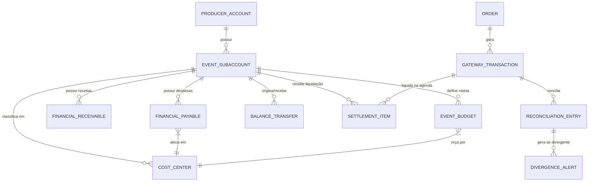

# ARQUITETURA MESTRE — NÚCLEO ERP FINANCEIRO POR EVENTO
## Plataforma SafeSaff / PDT (DiskIngressos)

---

### 1. Visão Executiva e Estrutura Geral

O **Núcleo ERP Financeiro por Evento** do SafeSaff/PDT foi concebido para entregar uma gestão financeira corporativa com a robustez e elegância de um ERP como o Conta Azul, customizado para a dinâmica de **produtoras de eventos, festivais, casas de show e bilheteria eletrônica**.

```
                           ERP FINANCEIRO SAFESAFF
                                     │
      ┌──────────────────────────────┼──────────────────────────────┐
      │                              │                              │
┌─────▼───────────────┐    ┌─────────▼─────────────┐    ┌───────────▼─────────────┐
│    26.17.9.4.1      │    │      26.17.9.4.2      │    │       26.17.9.4.3       │
│  CONTA FINANCEIRA   │    │   GESTÃO FINANCEIRA   │    │ CONCILIAÇÃO & LIQUIDAÇÃO│
├─────────────────────┤    ├───────────────────────┤    ├─────────────────────────┤
│ • Conta do Produtor │    │ • Contas a Pagar      │    │ • Gateways de Pagamento │
│ • Subcontas/Evento  │    │ • Contas a Receber    │    │ • Agenda de Liquidação  │
│ • Saldo Disponível  │    │ • Fornecedores/Artistas│   │ • 3 Níveis Conciliação  │
│ • Extrato / Ledger  │    │ • Centros de Custos   │    │ • Central Divergências  │
│ • Transferências    │    │ • Orçamentos (4D)     │    │ • Split Automático      │
│ • Reserva Cautelar  │    │ • Resultado Operacion.│    │ • Baixa Automática      │
└─────────────────────┘    └───────────────────────┘    └─────────────────────────┘
                                     │
                                     ▼
                        ┌─────────────────────────────┐
                        │         26.17.9.4.4         │
                        │    INTELIGÊNCIA GERENCIAL   │
                        ├─────────────────────────────┤
                        │ • Fluxo de Caixa Projetado  │
                        │ • DRE Gerencial por Evento  │
                        │ • Margem de Contribuição    │
                        │ • Consolidado do Produtor   │
                        └─────────────────────────────┘
```

---

### 2. Regras Invioláveis de Proteção do Ecossistema

> [!IMPORTANT]
> **Salvaguardas de Compatibilidade e Preservação de Módulos Existentes**:
> 1. **Dashboard Financeiro Intacto**: O Dashboard Financeiro existente (`#view-financial-dashboard`, acessado pelo Hub Financeiro) **não será substituído, excluído ou desconfigurado**. O ERP por Evento se integra de forma modular e expansível.
> 2. **Estornos & Devoluções Independente**: O módulo de **Devoluções / Estornos (`#view-financial-refunds`) continuará 100% independente**, mantendo suas regras operacionais de cancelamento e estorno de ingressos inalteradas, servindo como fonte de dados de retenção/bloqueio contábil.

---

### 3. Detalhamento dos Quatro Pilares do ERP Financeiro

#### Pilar 1: 26.17.9.4.1 — Conta do Produtor + Subcontas por Evento + Transferências
*(Homologado e Ativo em Produção nas Subfases 26.17.9.5.1 a 26.17.9.5.4)*

- **Conta Mãe do Produtor**: Consolida todos os saldos e eventos sob um único CNPJ/Produtor.
- **Subcontas por Evento**: Cada evento possui sua segregação contábil estrita com a fórmula de liquidez real:
  $$\text{Saldo Disponível} = \max(0, \, \text{Saldo Base Liquidado} - \text{Comprometido} - \text{Bloqueado})$$
- **Aguardando Liquidação**: Vendas aprovadas no gateway mas ainda não compensadas na agenda bancária não compõem o saldo disponível.
- **Transferências Internas com Reserva Cautelar**: Movimentação entre subcontas com criação prévia de bloqueio (`TRANSFERENCIA_RESERVA`), mantendo invariância patrimonial:
  $$\Delta \text{Saldo Consolidado} = \text{R\$\ } 0,00$$
- **Alçadas e Segregação**: Quem solicita a transferência não pode aprovar.
- **Histórico & Trava Anti-Estorno**: Histórico auditável append-only e bloqueio de estorno caso o evento recebedor já tenha consumido o saldo (`ESTORNO_BLOQUEADO_SALDO`).

---

#### Pilar 2: 26.17.9.4.2 — Contas a Pagar + Contas a Receber + Centro de Custos + Orçamentos

Transforma os saldos contábeis em gestão operacional ativa de despesas e receitas de produção:

1. **Contas a Pagar (`FinancialPayable`)**:
   - Credores especializados: Artistas/Cachês, Infraestrutura, Som/Luz, Segurança, Staff, ECAD, Impostos Municipais, Marketing/Tráfego.
   - Ciclo de Vida: `PREVISTO` $\to$ `APROVADO` $\to$ `COMPROMETIDO` $\to$ `PAGO` (ou `CANCELADO`).
   - **Integração com Saldo do Evento**: Ao ser aprovado, o Contas a Pagar entra automaticamente na rúbrica **Comprometido** da subconta do evento, impedindo que o produtor transfira ou retire dinheiro já destinado a despesas.
2. **Contas a Receber (`FinancialReceivable`)**:
   - Patrocínios, permutas, cotas de camarote/estacionamento, bilheteria física PDV direta, aluguéis de espaços.
   - Ciclo de Vida: `A_RECEBER` $\to$ `LIQUIDADO` $\to$ `INADIMPLENTE` $\to$ `CANCELADO`.
3. **Centros de Custo por Evento (`CostCenter`)**:
   - Classificação gerencial padronizada por evento (ex: *1. Artístico*, *2. Estrutura*, *3. Operacional*, *4. Marketing*, *5. Legal/Taxas*).
4. **Comparativo Orçamentário Quadridimensional (`EventBudget`)**:
   - Em cada centro de custo:
     $$\text{Orçado} \quad \times \quad \text{Comprometido} \quad \times \quad \text{Realizado (Pago)} \quad \times \quad \text{Saldo do Orçamento}$$
   - Alerta imediato de estouro orçamentário (`BUDGET_OVERFLOW`).
5. **Resultado Operacional do Evento**:
   - Visão em tempo real da apuração financeira das operações do evento.

---

#### Pilar 3: 26.17.9.4.3 — Conciliação Bancária + Gateways + Liquidação Automática

Fecha o ciclo de ponta a ponta desde o momento em que o fã clica em comprar até o dinheiro virar repasse:

```text
VENDA DO INGRESSO
       ↓
PEDIDO
       ↓
TRANSAÇÃO
       ↓
GATEWAY
       ↓
RECEBÍVEL
       ↓
AGENDA DE LIQUIDAÇÃO
       ↓
VALOR LIQUIDADO
       ↓
CONCILIAÇÃO AUTOMÁTICA
       ↓
SPLIT
 ┌─────┴──────────┐
 ↓                ↓
DiskIngressos    Produtor
                  ↓
            Saldo do Evento
                  ↓
       Conta do Produtor
                  ↓
               Repasse
```

##### Os Três Níveis de Conciliação
1. **Nível 1 — Pedido × Gateway**:
   - Confirma se cada pedido do DiskIngressos possui cobrança autorizada e capturada no gateway correspondente (TID, NSU, payload).
   - Identifica pedidos não autorizados, duplicidades de cobrança e carrinhos abandonados.
2. **Nível 2 — Gateway × Liquidação**:
   - Confronta o extrato do gateway e a agenda bancária:
     - Valor Bruto
     - (-) Taxa MDR acordada
     - (-) Taxa de Antecipação (se houver)
     - (-) Estornos ocorridos
     - (-) Chargebacks / Contestações
     - (=) Valor Líquido Depositado.
3. **Nível 3 — Liquidação × Ledger**:
   - Garante que a entrada na Subconta do Evento no Ledger ocorra **somente com dinheiro efetivamente liquidado e compensado**.

##### Central de Divergências (9 Estados Operacionais)
Um motor de regras analisa 100% dos lançamentos e os classifica em:
- `CONCILIADO`: Batimento perfeito de valor, data e taxas.
- `VALOR_DIVERGENTE`: Valor capturado difere do valor total do pedido.
- `TAXA_DIVERGENTE`: MDR aplicado pelo adquirente é superior ao contrato comercial.
- `LIQUIDACAO_AUSENTE`: Transação capturada cujo vencimento da agenda D+x passou sem crédito bancário.
- `PEDIDO_NAO_LOCALIZADO`: Transação capturada no gateway sem pedido correspondente no DiskIngressos.
- `DUPLICIDADE`: Mais de uma captura para o mesmo `orderId`.
- `ESTORNO`: Reembolso formal processado.
- `CHARGEBACK`: Contestação aberta pelo titular do cartão.
- `REQUER_ANALISE`: Transação com divergência de titularidade, split incorreto ou erro de integração.

---

#### Pilar 4: 26.17.9.4.4 — Fluxo de Caixa + DRE Gerencial por Evento + Resultado Consolidado do Produtor

Camada de Business Intelligence & Controladoria Financeira:
- **Faturamento por Evento**: Receita Bruta de Bilheteria por lote, setor e canal de venda (Online DiskIngressos × PDV Físico).
- **Custos do Evento**: Despesas rateadas e diretas vinculadas aos Centros de Custos.
- **A Receber**: Projeção detalhada da agenda de liquidação dos gateways e patrocínios a receber.
- **Margem de Contribuição**:
  $$\text{Margem} = \text{Receita Líquida} - \text{Custos Variáveis}$$
- **Projeção de Fluxo de Caixa**: Calendário financeiro diário por evento antecipando necessidades de cobertura financeira ou sobras para repasse.
- **Resultado Consolidado do Produtor**: DRE unificado comparando a performance e lucratividade de toda a carteira de eventos da produtora.

---

### 4. Matriz de Entidades e Relacionamentos



---

### 5. Roadmap de Implantação

| Fase | Escopo Principal | Entregáveis | Status |
| :--- | :--- | :--- | :---: |
| **26.17.9.4.1** | Conta Produtor, Subcontas por Evento, Transferências e Saldos | `eventBalanceService`, `balanceTransferService`, Modais de Transferência e Histórico Append-Only | **Concluído & Homologado** |
| **26.17.9.4.2** | Contas a Pagar, Contas a Receber, Centros de Custo e Orçamentos | Modelos de dados, serviços de orçado × realizado, telas de gestão operacional e alimentação do saldo comprometido | **Próxima Fase** |
| **26.17.9.4.3** | Conciliação 3 Níveis, Liquidação Automática, Gateways e Divergências | Gateway de conciliação, motor de matching de 3 níveis, Central de Divergências (9 status) e Split DiskIngressos × Produtor | Planejado |
| **26.17.9.4.4** | Fluxo de Caixa Projetado, DRE por Evento e Consolidado do Produtor | Visão executiva de margem, projeção de liquidações, DRE multi-evento e ponto de equilíbrio | Planejado |
