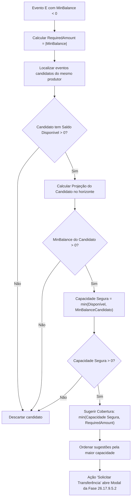

# MAPA DE FONTES DE DADOS — PROJEÇÃO DE CAIXA E REPASSES POR EVENTO
## Fase 26.17.9.5.5 — Plataforma SafeSaff / PDT (DiskIngressos)

---

### 1. Objetivo do Mapeamento

Mapear a procedência contábil e operacional de cada componente do fluxo de caixa projetado para cada subconta de evento e para a conta consolidada do produtor, garantindo:
- Separação estrita entre **Saldo Real** e **Saldo Projetado** (RN01).
- Proibição de valores fictícios, mocks permanentes ou dados arbitrários.
- Reutilização das bases oficiais homologadas nas Fases 26.17.9.5.1 a 26.17.9.5.4.

---

### 2. Inventário de Fontes Reais do Sistema

| Componente | Fonte Oficial no PDT | Tipo Contábil | Regra de Tratamento no Fluxo Projetado |
| :--- | :--- | :--- | :--- |
| **Produtor (Conta Mãe)** | `OFFICIAL_PRODUCERS` (`prod-1`, `prod-2`) | Identidade Contábil | Delimita a segregação de liquidez e alçadas de transferência. |
| **Subcontas por Evento** | `getLocalBalanceStore()` / `GET /api/finance/balances/events` | Entidade Patrimonial | Fornece `availableBalance`, `committedBalance`, `blockedBalance`, `pendingSettlement`. |
| **Saldo Disponível Atual** | `calculateEventAvailableBalance()` | Ponto de Partida ($t_0$) | Base inegociável de liquidez imediata. Nunca acrescido de projeção para autorizar transferências. |
| **Liquidações Futuras (Inflows)** | `pendingSettlement` / Gateways de Cartão e PIX | Entrada Prevista | Vendas de ingressos já aprovadas aguardando prazo de compensação da agenda bancária (D+x). |
| **Repasses Programados (Outflows)** | `commitments.scheduledPayouts` / Módulo de Repasses | Saída Prevista | Pagamentos programados ao produtor com data futura. Evita dupla dedução se já no comprometido. |
| **Despesas Previstas (Outflows)** | `commitments.reservedExpenses` / Módulo de Despesas | Saída Prevista | Custos operacionais vinculados a fornecedores cadastrados com vencimento no horizonte. |
| **Antecipações (Outflows)** | `commitments.advances` / Antecipações de Recebíveis | Saída / Liquidação | Desconto de taxa e impacto programado de liquidação antecipada. |
| **Transferências Pendentes** | `balanceTransferService.getTransfers()` | Impacto Cruzado | Transferências em status `PENDING_APPROVAL`: saída já reservada na origem; entrada futura no destino. |
| **Estornos & Chargebacks** | Módulo de Devoluções (`financial-refunds`) | Risco de Saída | Média móvel real de contestações e estornos pendentes de efetivação. |
| **Bloqueios e Reservas** | `blocks.operationalBlocks`, `blocks.chargebacks` | Retenção | Deduzidos na origem da disponibilidade. |

---

### 3. Equação Mestre da Curva de Caixa Diária ($t \in [1, H]$)

Para cada dia $t$ dentro do horizonte $H \in \{7, 15, 30, 60, 90\}$ dias:

$$\text{SaldoProjetado}(t) = \text{SaldoProjetado}(t-1) + \sum \text{EntradasPrevistas}(t) - \sum \text{SaidasPrevistas}(t)$$

Sendo no dia $0$:
$$\text{SaldoProjetado}(0) = \text{SaldoDisponivelAtual}$$

#### Métricas Derivadas
- **Menor Saldo Projetado**:
  $$\text{MinBalance} = \min_{t \in [1, H]} \text{SaldoProjetado}(t)$$
- **Data Crítica**:
  $$t_{\text{critico}} = \arg\min_{t \in [1, H]} \text{SaldoProjetado}(t)$$
- **Necessidade de Cobertura**:
  $$\text{RequiredAmount} = \begin{cases} |\text{MinBalance}|, & \text{se } \text{MinBalance} < 0 \\ 0, & \text{caso contrário} \end{cases}$$

---

### 4. Classificação de Risco e Gatilhos

| Status de Risco | Critério Matemático | Ação do Sistema |
| :--- | :--- | :--- |
| **NORMAL** | $\text{MinBalance} \ge 0.15 \times \text{SaidasPrevistas}$ | Nenhuma ação corretiva necessária. Folga financeira saudável. |
| **ATENCAO** | $0 \le \text{MinBalance} < 0.15 \times \text{SaidasPrevistas}$ | Alerta executivo de margem estreita de liquidez. |
| **CRITICO** | $\text{MinBalance} \le \text{SafetyBuffer}$ (margem $< 5\%$) | Notificação prioritária e recomendação preventiva de monitoramento. |
| **DEFICIT_PROJETADO** | $\text{MinBalance} < 0$ | Aciona o motor de sugestão de cobertura entre eventos do mesmo produtor. |

---

### 5. Algoritmo de Recomendação de Cobertura Entre Eventos

> [!CAUTION]
> **Proibição de Execução Automática**:
> O sistema jamais transfere saldo por conta própria com base em projeções. Toda sugestão aprovada pelo gestor humano vira uma solicitação formal que passa por caução preventiva (`TRANSFERENCIA_RESERVA`), aprovação de alçadas e auditoria append-only.
